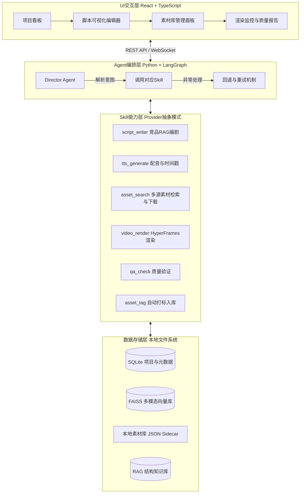

# VideoForge：知识科普视频自动化生产系统方案设计 (开工版)

**作者**：Manus AI
**更新日期**：2026-05-28

## 1. 项目愿景与核心定位

本项目（暂定名 **VideoForge**）是一套面向知识区 UP 主的“本地优先”视频自动化生产工作台。区别于 MoneyPrinterTurbo 等追求数量的通用型开源项目，VideoForge 专注于**高质量知识科普内容**（如 B 站花生视频风格），致力于解决“学科严谨性”、“叙事结构”与“视觉表现力”三大核心痛点。

### 1.1 为什么不使用现有方案？
* **不用花生视频平台**：出于隐私考虑，不希望将自有素材与工具上传至第三方平台；且本地自建流水线能完全掌控知识产权，方便后期引流变现。
* **不用 MoneyPrinterTurbo**：MPT 的 LLM 编剧是“凭空创作”，缺乏叙事节奏（AI 味重）；渲染基于 MoviePy，只能做“PPT 式轮播”；素材搜索依赖 Pexels，无法做到学科严谨匹配。
* **不用 OpenCut 自动化**：OpenCut 更适合作为成片后的人工精修工具，其无头模式尚不成熟，大模型直接写 HTML/CSS 的成功率远高于操作复杂 JSON 时间轴。

### 1.2 VideoForge 的差异化价值
1. **内容深度：竞品 RAG 编剧**。抓取 YouTube/Bilibili 优质科普视频字幕，提取爆款叙事结构，再注入用户知识点生成脚本，彻底消除“AI 味”。
2. **学科严谨：本地 FAISS 精准检索**。摒弃网络随机抓取无关素材，强依赖自有网站的高精度动画录屏与本地实拍视频，确保画面与知识点精确匹配。
3. **视觉张力：HyperFrames 动效渲染**。采用 HTML/CSS/GSAP 驱动的 HyperFrames 渲染引擎，实现动态排版、高级转场与梗图飞入特效。
4. **质量可控：三级 QA 与人工微调**。内置多模态大模型一致性核查，且提供 Web UI 允许用户在脚本、HTML 模板阶段进行人工微调。

---

## 2. 系统全景架构设计

系统采用 `React/TypeScript` 前端 + `Python/FastAPI` 后端的混合架构，核心功能抽象为独立 Agent Skills，通过状态机进行编排调度。



---

## 3. 核心模块详细设计

### 3.1 编剧模块 (Competitor RAG Script Writer)
* **目标**：解决“AI 味”，生成有叙事节奏的结构化脚本。
* **工作流**：
  1. **数据获取**：使用 `yt-dlp` 配合字幕抓取工具，批量下载优质科普视频（如 3Blue1Brown、花生视频）的完整字幕。
  2. **结构提取**：LLM 分析字幕，提取叙事结构模板（如“悬念开场 -> 核心原理 -> 梗图调侃”），存入 RAG 知识库。
  3. **脚本生成**：用户输入知识点，系统检索匹配的结构模板，调用国内高性价比 LLM API（硅基流动 DeepSeek-V3/R1 或 阿里云百炼 Qwen-Max），生成包含旁白、素材关键词的结构化 JSON 分镜表。

### 3.2 素材检索与打标模块 (Multi-source Asset Search & Tagging)
* **目标**：解决素材“文不对题”，最大化利用存量自有资源。
* **冷启动打标（双轨制）**：存量素材通过 `PySceneDetect` 自动切片，`CLIP` 提取向量，`Gemini Flash` 生成语义描述写入 JSON Sidecar，建立本地 FAISS 索引。标记为 `reviewed: false` 待人工抽查。
* **检索与下载策略**：
  1. **本地优先**：根据分镜关键词在本地 FAISS 库中精准检索。
  2. **在线兜底**：若未命中，调用 `yt-dlp` 在 YouTube/Bilibili 等平台搜索并下载符合 CC 协议的视频片段，自动切片入库。
  3. **降级方案**：调用 Pexels API 获取静态图片。

### 3.3 声音与时间轴模块 (Audio & Timeline)
* **TTS 生成**：接入 CosyVoice 2（支持本地部署或云端 API），生成带情感配音及字级时间戳（Word-level Timestamps）。
* **时长控制**：知识点音频片段控制在约 60 秒，保持紧凑节奏。
* **背景音乐**：一期可手动指定或随机选取，后期完善卡点（基于 `librosa` 提取鼓点对齐画面）。

### 3.4 渲染引擎模块 (HyperFrames Render)
* **目标**：打破“PPT 式轮播”天花板，实现极具网感的动态排版与特效。
* **工作流**：将音频、视频路径、时间戳注入预设 HTML 模板。利用 GSAP 动画库实现复杂动效，调用 HyperFrames CLI 无头浏览器逐帧渲染合成 MP4。

### 3.5 质量验证模块 (QA System)
* **目标**：防范盲盒式产出，确保最终成片质量。
* **三级检测**：
  1. **基础关**：FFprobe 检测黑屏、静音及时间轴异常。
  2. **同步关**：Whisper 重新识别音轨，比对字幕时间轴，偏差 > 0.5s 触发重试。
  3. **语义关**：Gemini Flash 多模态核查画面内容与旁白知识点的一致性，防范“幻觉”。

---

## 4. 实施与开发计划 (Roadmap)

项目实施遵循“**先验证核心表现力，再补全智能链路，最后实现产品化**”的原则。

### Phase 1: 渲染闭环验证（最优先，排除最大风险）
* **目标**：不写后端代码，纯手工组装数据，验证 HyperFrames 能否渲染出“花生视频”风格的成片。
* **任务**：
  1. 编写 2-3 套包含高级动效（动态字幕、梗图飞入、缩放转场）的 HTML/CSS 视频模板。
  2. 手动准备音频与视频片段，硬编码写入 HTML 运行渲染，评估最终 MP4 的视觉效果。

### Phase 2: 竞品 RAG 编剧链路（内容质量核心）
* **目标**：跑通“竞品字幕 -> 提取结构 -> 生成新脚本”的 RAG 链路。
* **任务**：
  1. 编写 Python 脚本，使用 `yt-dlp` 抓取 YouTube/Bilibili 视频字幕。
  2. 接入国内 LLM API（如硅基流动 DeepSeek），编写 Prompt 提取脚本结构。
  3. 跑通从输入知识点到输出结构化 JSON 分镜表的代码。

### Phase 3: 存量素材打标与检索系统（数据基础）
* **目标**：让本地存量资源变得“可被 AI 检索”。
* **任务**：
  1. 集成 PySceneDetect、CLIP、FAISS 完成存量素材的自动切片与向量化入库。
  2. 接入 Gemini Flash API，批量生成 JSON Sidecar 语义标签。
  3. 编写多源检索脚本（本地优先，yt-dlp 兜底）。

### Phase 4: Agent 组装与 Web UI 工作台（产品化交付）
* **目标**：提供完整的全自动后台流水线与前端交互界面。
* **任务**：
  1. 封装所有 Skills，使用 Python 状态机进行调度流转。
  2. 使用 `React + TypeScript` 开发 Web UI，包含素材库管理、脚本可视化编辑器（支持人工微调）。
  3. 实现全链路联调与三级 QA 验证。

---

## 5. 建议的工作模式（人机协同）

自动生成的视频只是一个“80分的草稿”，最终的质量上限由人工介入决定：

```
自动流水线（生成80分草稿）
    ↓
[可选] 第一层微调：修改 JSON 脚本（调整旁白/替换检索素材）
    ↓
[可选] 第二层微调：修改 HTML 模板（调整动画/字幕样式）
    ↓
HyperFrames 渲染 → MP4
    ↓
[可选] 第三层微调：OpenCut / 剪映 精修（人工润色、加贴纸）
    ↓
发布
```

随着本地模板的积累和素材库的丰富，人工介入的比例会逐渐降低。常规知识点视频可实现全自动，仅特殊效果或重点内容需人工微调。
