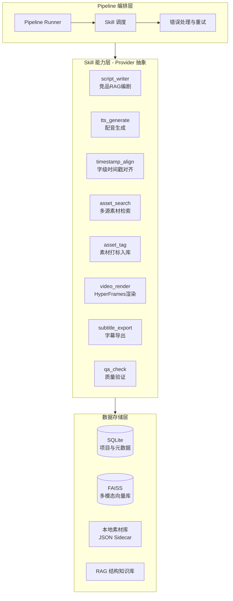

# VideoForge：知识科普视频自动化生产系统方案设计（定稿版）

**更新日期**：2026-05-29

---

## 1. 项目定位

VideoForge 是一套面向知识区 UP 主的"本地优先"视频自动化生产工作台。

### 核心差异化

与 MoneyPrinterTurbo、ViMax、OpenReels 等项目的**根本区别**：VideoForge 不用 AI 生成画面，而是**智能检索和组合真实素材**（自有素材库 + 线上视频/图片资源）。对知识科普视频来说，这保证了学科严谨性——AI 生成的画面容易出现事实性错误。

| 差异化 | 实现方式 |
|--------|----------|
| 消除 AI 味 | 竞品 RAG 提取叙事结构模板，注入用户知识点生成脚本 |
| 学科严谨 | 本地自有素材库 + 线上真实视频/图片检索组合（非 AI 生成） |
| 视觉张力 | HyperFrames HTML/CSS/GSAP 动效渲染，打破 PPT 轮播 |
| 质量可控 | 三级 QA + 分层人工微调 |

### 不使用现有方案的原因

- **花生视频平台**：隐私考虑 + 知识产权掌控
- **MoneyPrinterTurbo**：LLM 编剧无叙事节奏；MoviePy 仅支持 PPT 式轮播；Pexels 素材与学科无关
- **OpenCut**：成片精修工具，无头模式不成熟；LLM 写 HTML/CSS 的成功率远高于操作复杂 JSON 时间轴

---

## 2. 系统架构

### 2.1 全景架构



### 2.2 Skill / Provider 抽象设计

**每个 pipeline 节点抽象为一个 Skill，每个 Skill 可以有多个 Provider 实现。** 切换实现只需改配置，不改 pipeline 代码。

```python
from abc import ABC, abstractmethod
from dataclasses import dataclass

# --- Skill 接口示例 ---

class TTSSkill(ABC):
    """配音生成 Skill"""
    @abstractmethod
    def generate(self, text: str, voice: str, **kwargs) -> TTSResult:
        """输入文本，输出音频文件路径 + 音频时长"""
        ...

class AssetSearchSkill(ABC):
    """素材检索 Skill"""
    @abstractmethod
    def search(self, query: str, top_k: int = 5, **kwargs) -> list[AssetResult]:
        """输入关键词，返回匹配素材列表"""
        ...

# --- Provider 实现示例 ---

class EdgeTTSProvider(TTSSkill):
    """免费、无需 GPU、一期默认"""
    def generate(self, text, voice, **kwargs): ...

class CosyVoiceProvider(TTSSkill):
    """高质量中文、需要 GPU"""
    def generate(self, text, voice, **kwargs): ...

class ElevenLabsProvider(TTSSkill):
    """最高质量、云端 API、需付费"""
    def generate(self, text, voice, **kwargs): ...
```

**配置驱动选择 Provider**：

```yaml
# config.yaml
skills:
  tts:
    provider: edge_tts        # 一期默认
    # provider: cosyvoice     # 二期切换
    # provider: elevenlabs    # 需要最高质量时
  asset_search:
    provider: local_faiss      # 本地优先
    fallback: youtube_dl       # 线上兜底
  script_writer:
    provider: deepseek_rag
    llm_api: siliconflow       # 硅基流动 DeepSeek-V3
  video_render:
    provider: hyperframes
  qa_check:
    provider: multi_level      # 三级 QA
```

**设计原则**：
- 每个 Skill 定义清晰的输入/输出数据结构
- Provider 之间通过同一接口互换
- MVP 阶段用 Python ABC 即可，不需要框架
- 未来新增能力（如 AI 配乐、自动封面）只需新增 Skill

---

## 3. 核心模块设计

### 3.1 编剧模块 `script_writer`

**目标**：消除 AI 味，生成有叙事节奏的结构化分镜脚本。

**工作流**：
1. `yt-dlp` 抓取优质科普视频字幕（3Blue1Brown、花生视频等）
2. LLM 分析字幕，提取抽象叙事结构模板（如"悬念开场→核心原理→梗图调侃"），存入本地知识库
3. 用户输入知识点 → 检索匹配结构模板 → LLM 生成包含旁白、素材关键词的 JSON 分镜表

**集成工具**：

| 工具 | 用途 |
|------|------|
| [yt-dlp](https://github.com/yt-dlp/yt-dlp) (100k+ ⭐) | 字幕下载，`--write-subs --skip-download` |
| [FAISS](https://github.com/facebookresearch/faiss) (40k+ ⭐) | 结构模板向量检索 |
| 硅基流动 DeepSeek-V3 / 阿里百炼 Qwen-Max | LLM 推理 |

**MVP 做法**：不引入 LangChain / LlamaIndex。直接用 FAISS + LLM API 调用，纯 Python 脚本实现 RAG 链路。

> [!WARNING]
> **法律注意**：RAG 仅提取**抽象叙事模式**（如结构节奏、叙事手法），不存储原文段落。yt-dlp 下载注意平台 ToS 和限速。

---

### 3.2 素材检索与打标模块 `asset_search` / `asset_tag`

**目标**：让自有素材库"可被 AI 检索"，实现画面与知识点精确匹配。

**这是 VideoForge 的核心竞争力模块。**

#### 冷启动打标流程

```
存量视频/图片 → PySceneDetect 自动切片 → CLIP 提取向量 → Gemini Flash 生成语义描述
    → 写入 JSON Sidecar（reviewed: false）→ FAISS 向量索引
```

#### 检索策略（三级）

1. **本地优先**：FAISS 向量检索自有素材库
2. **线上兜底**：`yt-dlp` 搜索 YouTube/Bilibili CC 视频，下载切片入库
3. **降级方案**：Pexels API 获取静态图片

**集成工具**：

| 工具 | 用途 |
|------|------|
| [PySceneDetect](https://github.com/Breakthrough/PySceneDetect) (~5k ⭐, v0.7) | 视频自动切片 |
| [OpenAI CLIP](https://github.com/openai/CLIP) (28k+ ⭐) | 视觉-文本向量提取 |
| [FAISS](https://github.com/facebookresearch/faiss) (40k+ ⭐) | 向量相似度检索 |
| Gemini Flash API | 语义描述生成 |

> [!NOTE]
> **CLIP 视频理解优化**：CLIP 是图像模型，建议每个场景提取首/中/尾多帧做 embedding 取均值。可先用 CLIP 初筛，仅对低置信度素材调用 Gemini Flash，控制 API 成本。

---

### 3.3 声音与时间轴模块 `tts_generate` / `timestamp_align`

**目标**：生成配音并获取精确字级时间戳，用于字幕同步。

#### TTS Provider 路线

| 阶段 | Provider | 说明 |
|------|----------|------|
| MVP / 一期 | [edge-tts](https://github.com/rany2/edge-tts) (8k+ ⭐) | 免费、快速、无需 GPU |
| 二期 | [CosyVoice 2](https://github.com/FunAudioLLM/CosyVoice) (21k+ ⭐) 或 [Fish Speech](https://github.com/fishaudio/fish-speech) (20k+ ⭐) | 高质量中文、可本地部署 |
| 高质量需求 | [ElevenLabs](https://elevenlabs.io/) | 最高质量、云端 API |

#### 字级时间戳获取

> [!CAUTION]
> CosyVoice 2 **不原生支持**字级时间戳。无论使用哪个 TTS 引擎，都需要独立的 Forced Alignment 步骤。

**标准链路**：

```
TTS 生成音频 → WhisperX forced alignment（音频 + 原始文本）→ 字级时间戳 JSON
```

| 工具 | 用途 |
|------|------|
| [WhisperX](https://github.com/m-bain/whisperX) | Whisper + forced alignment，输出 word-level timestamps |

#### 背景音乐

一期手动指定或随机选取。后期可基于 `librosa` 提取鼓点实现画面卡点。

---

### 3.4 渲染引擎模块 `video_render`

**目标**：打破 PPT 式轮播，实现动态排版与高级特效。

**核心工具**：[HyperFrames](https://github.com/heygen-com/hyperframes) (22k ⭐, Apache 2.0)

**工作流**：
1. 将音频路径、视频/图片路径、字级时间戳注入预设 HTML 模板
2. HTML/CSS/GSAP 定义动态字幕、梗图飞入、缩放转场等动效
3. `npx hyperframes render` 无头浏览器逐帧渲染，合成 MP4

#### 字幕策略（双轨）

| 类型 | 方式 | 说明 |
|------|------|------|
| **画面花字** | 烧录在视频中 | HyperFrames 模板的一部分，样式完全可控（动态高亮、重点强调） |
| **平台字幕** | 导出 SRT 文件 | 上传 B 站时挂载，用于搜索 SEO 和无障碍 |

`subtitle_export` Skill 负责从时间戳 JSON 生成标准 SRT 文件。

---

### 3.5 质量验证模块 `qa_check`

**三级检测**：

| 级别 | 工具 | 检测内容 | 失败策略 |
|------|------|----------|----------|
| 基础关 | FFprobe | 黑屏、静音、时间轴异常 | 定位问题源头，重新渲染 |
| 同步关 | [Whisper](https://github.com/openai/whisper) (69k+ ⭐) | ASR 重新识别，比对字幕偏差 | 偏差 > 0.5s → **重新运行 `timestamp_align`**（非重新渲染） |
| 语义关 | Gemini Flash 多模态 | 画面内容与旁白知识点一致性 | 标记问题片段，人工复核 |

> [!NOTE]
> 同步关的重试策略：偏差问题的源头是时间戳对齐，而非渲染。重试应从 `timestamp_align` Skill 开始，而非从 `video_render` 开始。

---

## 4. 同类项目参考

以下项目的**素材策略**与 VideoForge 不同（它们靠 AI 生成画面），但在特定环节有借鉴价值：

| 项目 | 值得借鉴的环节 |
|------|----------------|
| [OpenReels](https://github.com/tsensei/OpenReels) | 端到端 pipeline 编排；Web UI 管线可视化 |
| [OpenMontage](https://github.com/calesthio/OpenMontage) | YAML manifest 模块化 Skill 架构 |
| [ViMax](https://github.com/HKUDS/ViMax) | RAG 编剧引擎的 Prompt 设计 |
| [MoneyPrinterTurbo](https://github.com/harry0703/MoneyPrinterTurbo) (65k ⭐) | TTS / 字幕 / 音乐的集成方式 |

---

## 5. 实施路线 (Roadmap)

原则：**先验证核心表现力，再补全链路，最后产品化。**

### Phase 1：渲染闭环验证 ⭐ 最优先

**目标**：不写后端，纯手工组装数据，验证 HyperFrames 能否渲染出目标风格成片。

- [ ] 编写 2-3 套 HyperFrames HTML 模板（动态字幕、梗图飞入、缩放转场）
- [ ] 手动准备音频 + 视频片段，硬编码路径运行渲染
- [ ] 评估 MP4 视觉效果是否达到"花生视频"水准
- [ ] 验证字幕烧录 + SRT 导出链路

### Phase 2：编剧 + 配音链路

**目标**：跑通"知识点输入 → 结构化脚本 → 配音 + 时间戳"。

- [ ] `yt-dlp` 抓取字幕，LLM 提取叙事结构模板
- [ ] FAISS 索引结构模板，实现 RAG 检索
- [ ] 输入知识点 → 输出 JSON 分镜表
- [ ] edge-tts 生成配音 → WhisperX 生成字级时间戳
- [ ] 抽象 `script_writer`、`tts_generate`、`timestamp_align` 为 Skill

### Phase 3：素材打标与检索系统

**目标**：让存量素材可被 AI 检索。

- [ ] PySceneDetect + CLIP + FAISS 完成存量素材打标和向量化入库
- [ ] Gemini Flash 批量生成语义描述，写入 JSON Sidecar
- [ ] 编写多源检索策略（本地 → yt-dlp → Pexels）
- [ ] 抽象 `asset_tag`、`asset_search` 为 Skill

### Phase 4：Pipeline 串联与 Web UI

**目标**：全自动 pipeline + 人工微调界面。

- [ ] Pipeline Runner 串联所有 Skill（纯 Python 状态字典，不用 LangGraph）
- [ ] 三级 QA 验证集成
- [ ] React + TypeScript Web UI（项目看板、脚本编辑器、素材库管理）
- [ ] 如有需要，引入 LangGraph 做复杂编排

---

## 6. 人机协同工作模式

```
自动 pipeline（生成 80 分草稿）
    ↓
[可选] 第一层微调：修改 JSON 脚本（调整旁白 / 替换素材关键词）
    ↓
[可选] 第二层微调：修改 HTML 模板（调整动画 / 字幕样式）
    ↓
HyperFrames 渲染 → MP4 + SRT
    ↓
[可选] 第三层微调：剪映 / OpenCut 精修
    ↓
上传发布（挂载 SRT 字幕）
```

随着模板积累和素材库丰富，人工介入比例逐渐降低。

---

## 7. 技术栈总览

| 层次 | 技术选型 |
|------|----------|
| 渲染引擎 | HyperFrames + GSAP |
| 编剧 RAG | FAISS + LLM API（硅基流动 / 阿里百炼）|
| 素材打标 | PySceneDetect + CLIP + Gemini Flash |
| 素材检索 | FAISS 向量检索 + yt-dlp 兜底 |
| TTS 配音 | edge-tts（一期）→ CosyVoice 2 / ElevenLabs（后期）|
| 字级时间戳 | WhisperX forced alignment |
| 质量验证 | FFprobe + Whisper + Gemini Flash |
| 数据存储 | SQLite + FAISS + JSON Sidecar |
| 后端 | Python / FastAPI（Phase 4）|
| 前端 | React + TypeScript（Phase 4）|
| 架构模式 | Skill + Provider 抽象，配置驱动 |
